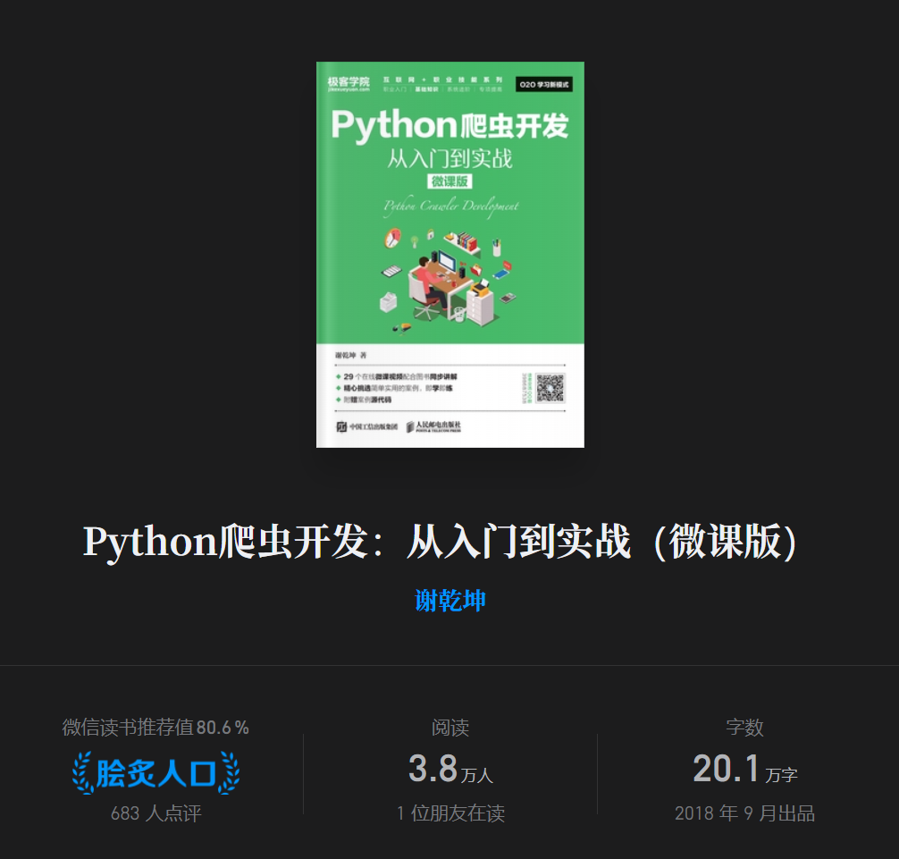
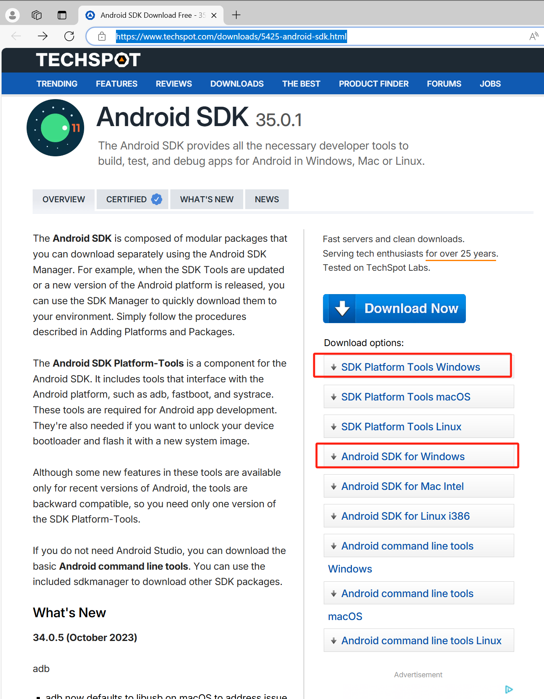
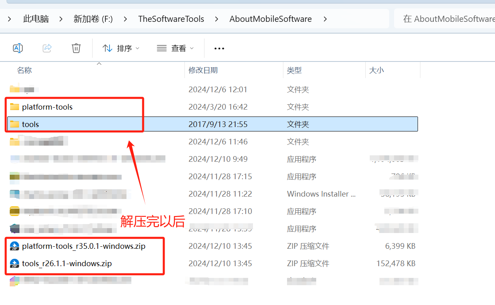

这本书我只针对app以及后面的章节来去做实验。从第十章开始的app抓包就存在很多问题，经过测试并且更换sdk测试版本最终达到实现本书中的效果。

在前面先列出本书相关的配套代码信息：

本人已fork：

https://github.com/mumu8848/SourceCodeOfBook

# 第十章

关于第十章的问题很多， 从最开始的环境搭建就有很多状况，这也是其它同类型书籍的通病，软件并不是一成不变的，
它可能在发布的第二天（极端情况）就开始改版，网页也是如此。

尤其是像这种爬虫类的程序，app程序改版更新完之后相应的爬虫程序也需要对其进行针对性的修改。

https://www.techspot.com/downloads/5425-android-sdk.html

上面的链接可以下载书中的软件工具，具体如下：

之后的操作指令就跟书中的一样了。

下面备注一些辅助我排坑的链接：

https://blog.csdn.net/aitong0065/article/details/101163735

https://blog.csdn.net/qq_40356449/article/details/103302820

[关键](https://www.cnblogs.com/walker20201219/p/14527776.html)
